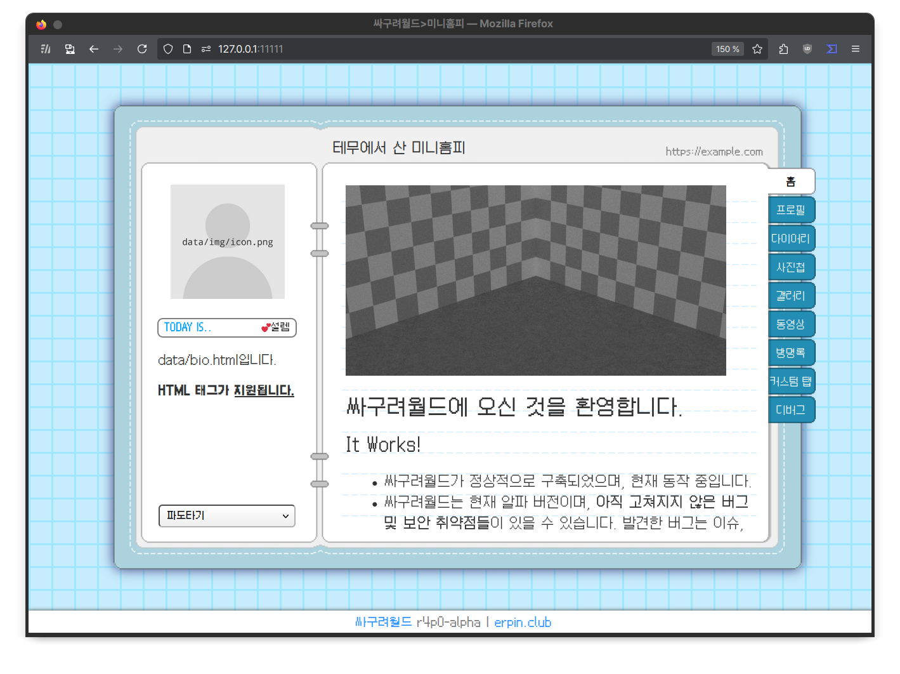

# 싸구려월드


**테무에서 산 싸이월드**

싸이월드 미니홈피를 재구현한 [Flask](https://flask.palletsprojects.com/en/3.0.x/) 웹 애플리케이션입니다.

## 어떻게 돌립니까?
### 직접 구성하기
1. Python venv를 준비합니다. 개발 환경이 3.11이었으며, 3.12에서 테스트 되었습니다.
2. `pip install -r requirements.txt`를 실행합니다. 앱 동작에 필요한 PyPI 디펜던시를 설치합니다.
3. `conf.py`를 수정합니다.
4. `python3 y2k_server.py`를 실행합니다.
5. data 디렉터리가 초기화되었습니다. `site_settings.yaml`을 포함한 사이트 구성을 취향에 맞게 변경합니다.

### Docker (레포지토리 사용)
> **Rocky Linux 9.4(x86_64), podman 4.9**를 기준으로 합니다. 배포판 및 Docker 설치 형태에 따라 일부 내용에 차이가 있을 수 있습니다.
```shell
# 이미지 빌드
docker build -t crapworld .
# 컨테이너를 만들고 실행
docker run -v [data가 저장될 장소]:/app/data -p [원하는 포트]:11111 --name [컨테이너 이름] crapworld
```

### Docker Hub
```shell
docker run -v [data가 저장될 장소]:/app/data -p [원하는 포트]:11111 --name [컨테이너 이름] libertin1/crapworld
```

### Apache2를 이용한 리버스 프록시 (Ubuntu)

Let's Encrypt SSL을 사용하고자 하는 경우, /etc/apache2/sites-available에 설정 파일을 만든 후, `a2ensite [설정 파일] && systemctl reload apache2`를 실행합니다.

예제 설정 :
```
<VirtualHost *:80>
        ServerName [도메인]
        Redirect permanent / https://[도메인]
</VirtualHost>

<VirtualHost *:443>
        ServerName [도메인]
        RemoteIPHeader CF-Connecting-IP

        RewriteEngine On
        RewriteCond %{REQUEST_URI} /api/v[0-9]+/(users/)?websocket [NC,OR]
        RewriteCond %{HTTP:UPGRADE} ^WebSocket$ [NC,OR]
        RewriteCond %{HTTP:CONNECTION} ^Upgrade$ [NC]
        RewriteRule .* ws://127.0.0.1:11111%{REQUEST_URI} [P,QSA,L]

        <Location />
                Require all granted
                ProxyPass http://127.0.0.1:11111/
                ProxyPassReverse http://127.0.0.1:11111/
                ProxyPassReverseCookieDomain 127.0.0.1 [도메인]
        </Location>

        SSLCertificateFile /etc/letsencrypt/live/[도메인]/fullchain.pem
        SSLCertificateKeyFile /etc/letsencrypt/live/[도메인]/privkey.pem
        Include /etc/letsencrypt/options-ssl-apache.conf
</VirtualHost>
```

## 라이센스
싸구려월드는 오픈 소스 프로젝트이며, [BSD 3-Clause](https://www.olis.or.kr/license/Detailselect.do?lId=1092) 라이센스로 제공됩니다.

해당 프로젝트를 사용하고자 하는 경우, 라이센스를 준수해야 합니다.

자세한 내용은 `LICENSE`를 참조하십시오.

## TODO
### 만들 것들
- [x] 커스텀 테마
- [x] (홈) 오늘의 기분
- [x] 다이어리
  - [x] 수정, 삭제
- [x] 갤러리 (= Instagram / X 피드)
- [x] 동영상
  - [ ] 새로 만들기
    - [ ] 카테고리
    - [ ] 엔트리
  - [ ] 수정
  - [ ] 삭제
- [x] 방명록 (= Quesdon@Planet)
- [x] 프로필
- [x] 사진첩
  - [x] 자세히 보기
  - [x] 새로 만들기 (카테고리, 사진 엔트리)
  - [x] 삭제
- [x] 동영상 (= YouTube)
- [x] 사이트 관리 도구
  - [x] 미디어 관리자
  - [x] 기본 설정
  - [x] 바이오
  - [x] 하단 바
  - [x] 파도타기
  - [x] 커스텀 탭
  - [x] 고급
- [ ] 로그인 기능
  - [ ] OOBE
### 만들 것들 (후순위)
- [ ] HTML 에디터로 Monaco Editor 사용
- [ ] Markdown 지원
- [ ] REST API 지원
- [ ] 쥬크박스
- [ ] 일촌평
- [ ] 자체 방명록
- [ ] 다이어리 댓글 작성
- [x] Dockerfile
### 개선할 것들
- [ ] (상시 퀘스트) 성능 개선이 가능한 로직을 [정상화](https://youtu.be/cYRkZmBuDqI)
  - [x] 캐싱 루틴 도입
- [x] 사진첩 이미지를 썸네일화하여 트래픽 및 로딩 시간 절감
- [ ] 방명록을 Quesdon@Planet으로 대체하는건 좋은 방법이 아닌 것 같음
- [ ] 테마를 css-only화
