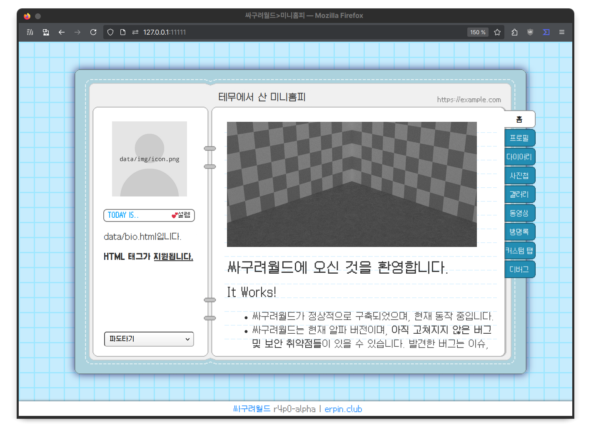

# 싸구려월드

**테무에서 산 싸이월드**

싸이월드 미니홈피에 모티브를 두고 개발중인 개인 웹사이트 프레임워크(=토이 프로젝트)입니다.

## 어떻게 돌립니까?

1. Python venv를 준비합니다. 개발 환경이 3.10이었으며, 3.12에서 테스트 되었습니다.
2. `pip install -r requirements.txt`를 실행합니다. 앱 동작에 필요한 PyPI 디펜던시를 설치합니다.
3. `data/site-settings.yaml`을 수정합니다.
4. `python3 y2k_server.py`를 실행합니다. 개발 모드로 서버를 실행시키며, 사이트의 기능들을 확인해볼 수 있습니다.
5. ~~[이 가이드](https://flask.palletsprojects.com/en/3.0.x/tutorial/deploy/)를 참조하여 `waitress-serve --port=(포트 번호) --call y2k_server:create_site`를 실행합니다. 이 명령어는 프로덕션 모드로 서버를 구동합니다.~~

## 라이센스
MIT 라이센스로 제공됩니다. `LICENSE`를 참조하십시오.

## TODO
### 만들 것들
- [x] 커스텀 테마
- [x] (홈) 오늘의 기분
- [x] 사진첩 / 갤러리 (= Instagram / X 피드)
- [x] 방명록 / 게시판 (= Quesdon@Planet)
- [x] 프로필
- [x] 사진첩
- [x] 동영상
- [ ] 사이트 관리 도구
### 만들 것들 (후순위)
- [ ] 쥬크박스
- [ ] 일촌평
- [ ] 자체 방명록
- [ ] 다이어리 댓글 작성
- [x] Dockerfile `정상 동작한다는 보장 없음`
### 개선할 것들
- [ ] (상시 퀘스트) 성능 개선이 가능한 로직을 [정상화](https://youtu.be/cYRkZmBuDqI)
